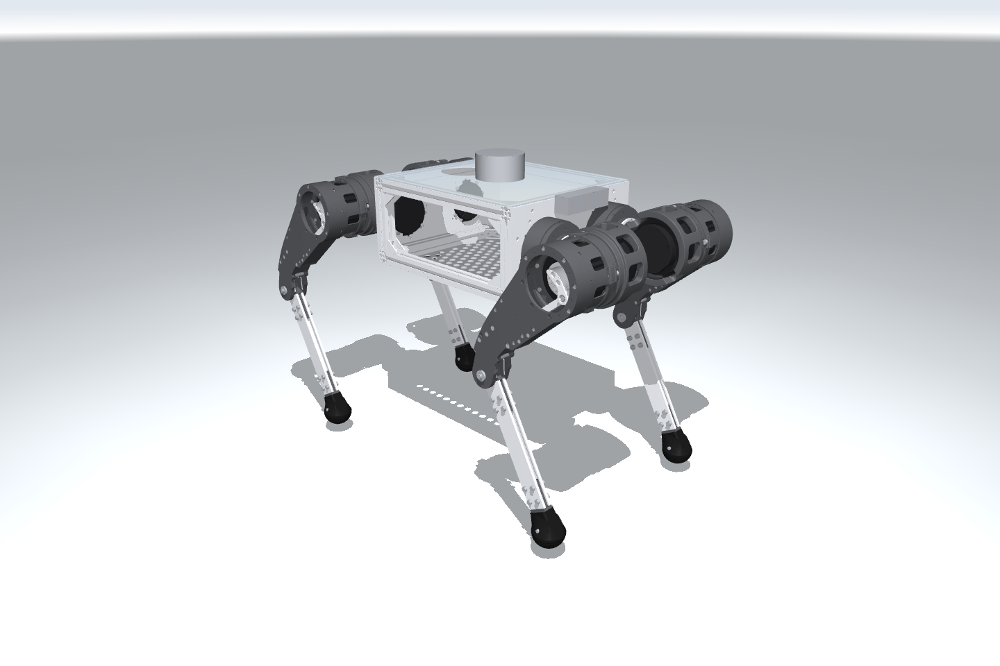
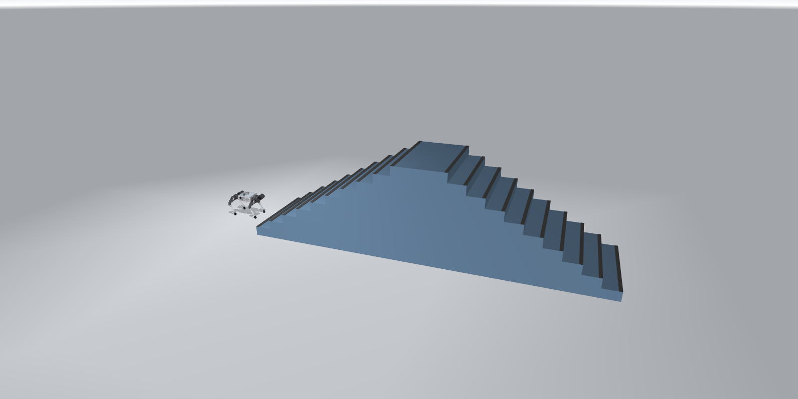

# URDF and Stair Map Updates

MuJoCo simulation for the **RS06 v5 quadruped**, with an updated URDF and a stair map based on measured dimensions. Robot and terrain construction are independent of the controller, so the same scene can be used for reinforcement learning or MPC development.

## Preview

### Current robot: RS06 v5



The supplied RS06 v5 URDF and STL meshes, rendered in the standing pose.

### Robot and stair scene



The robot at its initial standing pose beside the complete 18 cm stair course, including the raised edge strips. This is a static scene preview.

## Robot and terrain

| Parameter | Default |
|---|---|
| Robot mass, including electronics | 18.082756 kg |
| Actuated joints | 12 |
| Hip / thigh / calf torque limits | 17 / 23 / 30 Nm |
| Stair rise / tread depth | 18 / 32 cm |
| Stair count | 10 ascending + 10 descending |
| Landing length / stair width | 1.0 / 1.6 m |
| Raised edge strip | 5 mm high, 6 cm deep |

Robot assets are in `assets/rs06/`. Terrain dimensions are in `config/courses.json`. The URDF mass, inertia, joint limits and collision geometry are retained.

The default RS06 policy is experimental. Previous independent trials recorded 3/3 completions at 6, 10 and 12 cm, and 0/3 at 14 and 18 cm. Flat-ground survival was 3/3 over 60 seconds. Course completion does not establish gait quality or hardware safety. See [PROGRESS.md](PROGRESS.md) for results and remaining work.

## Installation

Use **Linux x86_64 and Python 3.11**. Both installation options use a Conda environment named **`robost`**. CPU simulation supports robot, terrain and controller development. Policy playback, evaluation and PPO training also require an NVIDIA GPU and a CUDA 13-compatible driver.

### 1. Prepare the system and download the repository

Install Conda first if it is unavailable; follow the [official Linux installation guide](https://docs.conda.io/projects/conda/en/stable/user-guide/install/linux.html). For Bash, run `conda init bash` and reopen the terminal before continuing.

On Ubuntu or Debian, install Git and the graphics libraries used by the desktop viewer and headless renderer:

```bash
sudo apt-get update
sudo apt-get install -y git libgl1 libegl1 libglfw3 libosmesa6

git clone https://github.com/Ro-bost/robost_02.git
cd robost_02
```

URDFs, meshes, maps and policy checkpoints are included in the checkout. Keep the checkout available after installation: the editable package loads assets and configuration from it. Run the commands below from this repository root.

### 2. Create and activate the environment

```bash
conda create -n robost python=3.11.16 pip=26.2.1 -y
conda activate robost
python --version
```

If `robost` already exists with Python 3.11, activate it and skip `conda create`. Activate `robost` again in each new terminal before using the commands in this README.

### 3. Install one dependency stack

**CPU simulation / MPC development** — install MuJoCo, rendering dependencies, this package and development tools:

```bash
python -m pip install --editable '.[simulation,dev]'
python -m pip check
```

**GPU policy execution / RL training** — install the pinned full stack and this package into the same environment:

```bash
nvidia-smi
python -m pip install --requirement config/requirements.txt \
  --extra-index-url https://pypi.nvidia.com/
python -m pip install --no-deps --editable .
python -m pip check
python -c "import torch; print(torch.__version__, torch.version.cuda); assert torch.cuda.is_available(), 'CUDA GPU is unavailable'"
```

`config/requirements.txt` installs the tested MuJoCo, PyTorch, CUDA runtime and mjlab versions. Git is needed for the pinned mjlab revision; a separate `third_party/` checkout is unnecessary. The NVIDIA driver is installed on the host, outside Conda. The [MuJoCo Python package](https://mujoco.readthedocs.io/en/stable/python.html#installation) includes the MuJoCo library.

As an alternative to the manual environment and dependency steps, run `python scripts/setup_environment.py --cpu-only` for CPU simulation, or `python scripts/setup_environment.py` for the full GPU stack, then `conda activate robost`. The helper creates `robost` when absent and checks installed dependencies.

### 4. Check the installation

Both stacks support these checks without opening a window:

```bash
robost-preview --check
robost-scene --check --output runs/scene_check
MUJOCO_GL=osmesa robost-scene --headless --duration 5 \
  --output runs/standing_check
```

Choose a new output directory when repeating a scene command. `glfw` opens the desktop viewer, `egl` provides headless rendering on a supported GPU, and `osmesa` provides headless software rendering. A desktop session is required for the GUI commands below.

## Simulation

Preview the robot or run the stair scene with bounded standing control:

```bash
MUJOCO_GL=glfw robost-preview
MUJOCO_GL=glfw robost-scene --duration 30
```

The scene command exports `scene.xml` and `scene.mjb` to a new directory under `runs/`. Standing control is a scene check, not a walking test. To restore the exported standing pose:

```python
mujoco.mj_resetDataKeyframe(model, data, model.key("stand").id)
```

Controllers can construct the model directly through `robost.simulation.model.robot_spec()` or obtain the complete robot and terrain through `robost.cli.scene.build_scene()`.

View policy walking in a desktop window:

```bash
MUJOCO_GL=glfw robost-stairs --stairs-cm 12 --play-seconds 60
MUJOCO_GL=glfw robost-stairs --stairs-cm 18 --play-seconds 60
```

Playback ends at the first failure. Omit `--play-seconds` to keep the failed pose visible. Use `--stairs-cm 0` for flat ground.

Evaluate without a window and save a video:

```bash
MUJOCO_GL=egl robost-stairs --stairs-cm 18 --headless --duration 60
```

The default checkpoint is `assets/policies/rs06.pt`, verified against `config/rs06_policy.json`. Every height uses the same checkpoint. Results include `evaluation.json`, `evaluation_1x.mp4`, `telemetry.npz`, `qpos_env0.npy` and `scene.mjb`. Existing output directories are never overwritten.

Evaluate multiple heights and seeds in independent processes:

```bash
MUJOCO_GL=egl robost-evaluate \
  --adapter rs06 --checkpoint assets/policies/rs06.pt \
  --heights 0 6 10 12 14 18 --seeds 42 43 44 \
  --repeats 1 --speed .25 --duration 60 --output runs/evaluation
```

Evaluation uses one environment with automatic resets disabled. It stops at the first failure. Completion requires each foot to land on the exit floor, followed by two seconds with all feet beyond x = 7.66 m. Bypassing the stairs fails the trial.

## Training

PPO settings are in `config/rs06_training.json`. Adapt the current checkpoint on mixed terrain:

```bash
robost-train --checkpoint assets/policies/rs06.pt \
  --stage mixed --num-envs 256 --iterations 800 --output runs/training
```

Available stages are `flat`, `low`, `stairs` and `mixed`. The commanded speed is 0.25 m/s. Mixed training retains 25% flat terrain and 25% low stairs, with an adaptive curriculum for the remaining 50%. Actor, critic and observation normalization are loaded; the optimizer starts fresh. The final checkpoint after 800 iterations is `model_799.pt`.

Training resets collect PPO data. Rewards and curriculum promotion are not evidence of course completion. Evaluate each new policy independently, including flat ground.

## Repository and development

```text
robost/
├── src/robost/       Simulation, RL, CLI and analysis tools
├── tests/           Model, terrain, policy and evaluation checks
├── assets/          Current URDF, meshes and policy
├── config/          Terrain, policy, training and environment settings
├── scripts/         Environment installation
├── history/         Minimal RS02 reproduction package
├── README.md        Installation and usage
└── PROGRESS.md      Results and remaining work
```

```bash
make check
make lint
make test-core
make test-rl
```

CPU-only installations support `make check lint test-core`. RL tests require the full environment. Use `make format` to apply the shared Python format.

Add code under `src/`, tests under `tests/` and settings under `config/`. Record any changes to physical parameters or completion criteria when comparing results. Report completion, gait quality and hardware safety separately. Generated runs are excluded from Git.

The historical RS02 URDF, 15/20 cm maps and policies are in `history/`. See [history/README.md](history/README.md) for execution and further training. Third-party and supplied-asset notices are in [NOTICE](NOTICE).
