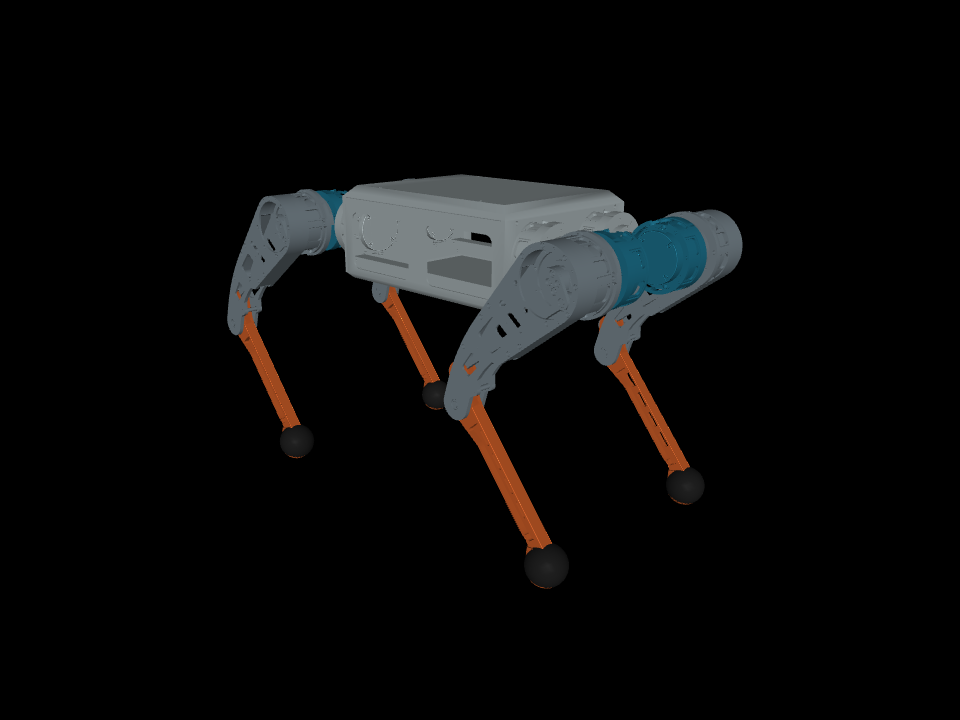

# ROBOST RS02

[](https://github.com/Ro-bost/robost_02/actions/workflows/check.yml)
[](https://www.python.org/)
[](https://mujoco.org/)

RS02 4족 로봇을 MuJoCo에서 구동하고, 평지와 계단에서 보행 제어기를 시험하기 위한 프로젝트입니다.
로봇의 질량, 관절 범위, 충돌 형상과 토크 제한을 유지한 상태에서 고전 제어기와 PPO 정책을 실행할 수 있습니다.



## 포함된 기능

- RS02 URDF, MuJoCo 모델과 시각 메시
- 평지 트롯 및 저속 계단 crawl 제어기
- `mjlab` + RSL-RL 기반 PPO 계단 보행 정책
- 15cm/20cm 계단 코스의 독립 평가와 1배속 영상 저장
- 관절 한계, 접촉, 토크와 코스 완주 판정 테스트

현재 제공하는 계단 정책은 높이별로 따로 선택한 정책입니다.

| 계단 높이 | 기본 정책 | 평가 조건 | 결과 |
|---:|---|---|---:|
| 15cm | rhythm, iteration 500 | 0.25m/s, seed 42/43/44 × 2 | 6/6 완주 |
| 20cm | rhythm, iteration 1000 | 0.25m/s, seed 42/43/44 × 2 | 6/6 완주 |

두 결과는 명목 시뮬레이션에서 얻은 값입니다. 동일한 정책의 높이 한계나 실물 로봇의 안전성을 뜻하지 않습니다.

## 설치

Ubuntu와 Python 3.11을 기준으로 확인했습니다. 정적 모델 확인과 고전 제어기는 CPU에서 실행할 수 있고,
PPO 정책 실행 및 학습에는 NVIDIA GPU와 CUDA 환경이 필요합니다.

### MuJoCo 모델과 고전 제어기

```bash
git clone https://github.com/Ro-bost/robost_02.git
cd robost_02

conda create -n rs02-sim python=3.11 pip -y
conda activate rs02-sim
python -m pip install -e '.[simulation]'

rs02-preview --check
```

창을 열어 서기 자세를 확인하려면 `rs02-preview`를 실행합니다.

MIT Cheetah의 swing trajectory를 사용하는 기존 crawl 제어기는 외부 소스와 `g++` 빌드가 추가로 필요합니다.

```bash
python scripts/bootstrap_dependencies.py --only Cheetah-Software eigen3
rs02-build-swing
rs02-walk --terrain stairs --step-height-cm 15 --duration 10 --headless
```

### PPO 계단 정책

RL 환경은 학습 당시 패키지 버전을 그대로 사용합니다.

```bash
python scripts/bootstrap_dependencies.py --only mjlab

conda create -n rs02-rl python=3.11.16 pip -y
conda activate rs02-rl
pip install uv==0.12.17
uv pip install --python "$CONDA_PREFIX/bin/python" -r requirements/rl-lock.txt \
  --extra-index-url https://pypi.nvidia.com/ --index-strategy unsafe-best-match
python -m pip install --no-deps -e .

python scripts/download_policies.py
```

## 실행

15cm 또는 20cm 계단 코스를 실시간으로 실행합니다.

```bash
rs02-stairs --stairs-cm 15 --speed 0.25
rs02-stairs --stairs-cm 20 --speed 0.25
```

화면 없이 평가하고 결과와 1배속 영상을 `runs/`에 저장하려면 다음과 같이 실행합니다.

```bash
rs02-stairs --stairs-cm 20 --speed 0.25 --headless --seed 42 --duration 40
```

정책을 고정해 여러 초기조건을 반복 평가할 수도 있습니다.

```bash
rs02-evaluate \
  --adapter rhythm \
  --checkpoint checkpoints/rs02_stairs/20cm.pt \
  --heights 20 --seeds 42 43 44 --repeats 2 \
  --speed 0.25 --duration 40 \
  --output runs/repeat_20cm
```

고전 제어기 예시는 아래와 같습니다.

```bash
rs02-mpc --terrain flat --speed 0.5 --duration 12 --headless
rs02-walk --terrain flat --speed 0.25 --duration 30 --headless
```

## 저장소 구조

```text
assets/                 RS02 URDF, MJCF, 메시와 README 이미지
configs/                정책 및 외부 의존성의 버전·해시
native/                 Cheetah swing trajectory C++ 연결 코드
requirements/           GPU RL 환경의 고정 패키지 목록
scripts/                외부 소스와 정책 다운로드 도구
src/robost/
  cli/                   사용자 명령
  rl/                    PPO 환경, 보상, 정책 어댑터와 판정
  simulation/            모델 로더, MPC와 crawl 제어기
  tools/                 결과 감사, 렌더링과 그래프 도구
tests/                   CPU 및 GPU 회귀 테스트
```

`runs/`, `checkpoints/`, 외부 저장소와 학습 로그는 Git에 포함하지 않습니다.

## 테스트

```bash
make check
make test-sim
```

RL 환경까지 설치한 경우 `make test-rl`을 실행합니다. GitHub Actions는 CPU 테스트를 매 push마다 실행합니다.

## 기반 프로젝트

- [mjlab](https://github.com/mujocolab/mjlab): GPU MuJoCo 학습 환경
- [RSL-RL](https://github.com/leggedrobotics/rsl_rl): PPO 구현
- [MIT Cheetah Software](https://github.com/mit-biomimetics/Cheetah-Software): swing trajectory

고정한 외부 소스 버전은 `configs/dependencies.json`에 기록되어 있습니다.
각 외부 프로젝트와 RS02 자산의 권리 조건은 [THIRD_PARTY_NOTICES.md](THIRD_PARTY_NOTICES.md)를 확인하세요.

## 라이선스

프로젝트 자체의 공개 라이선스는 아직 지정되지 않았습니다. 외부 코드와 제공 자산에는 각 원저작자의 조건이 적용됩니다.
