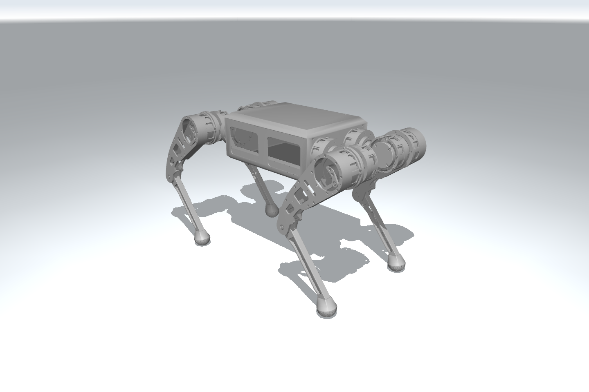

# RS02 재현 보관본

현재 RS06 코드와 독립적이며, `robost` 환경에서는 이 폴더만 복사해 실행할 수 있습니다.



보관된 `rs02/assets/rs02.urdf`와 원본 STL을 MuJoCo에서 렌더링한 서기 자세입니다.

## 구성과 조건

- `rs02/assets/`: 원본 URDF·MuJoCo 모델·참조 STL 13개.
- `rs02/policies/`: 15cm `rhythm500`, 20cm `rhythm1000` 정책. 두 높이는 서로 다른 정책을 사용합니다.
- `rs02/maps/`: 성공 당시 MJB에서 추출한 15/20cm 맵. `check`에서 원래 생성기와 형상을 대조합니다.
- `rs02/src/`: 실제 성공 실행의 원형 소스 7개.
- `rs02/run.py`: 실행 진입점. 정책 SHA-256을 검사하고 기존 출력 덮어쓰기를 거부합니다.

자산·정책의 원본 바이트와 해시를 유지했습니다. 런처는 모델 경로를 로컬 `assets/`로 연결하며, 내부 상대 링크 `assets/docs/mujoco_check_model.xml → ../rs02.xml`은 원형 코드의 파일명을 유지합니다. 외부 CAD·archive는 필요하지 않습니다. `run.py`로 실행하세요.

로봇은 **16.940606kg·12관절**, 토크 한계 **17/17/25.2Nm**입니다. 원래 질량·관성·관절 범위·PD·충돌·중력을 유지합니다. 물리 500Hz, 정책 50Hz, 평가 속도 0.25m/s입니다.

계단은 **상승 5단·하강 5단**, 높이 15/20cm, 디딤판 깊이 30cm, 폭 1.6m, 중간 평지 1m이며 돌출부는 없습니다. x=0.75~4.15m에 놓이고 출구 판정선은 x=4.30m입니다. 모든 발이 출구 바닥에 착지한 뒤 출구선을 지난 상태로 2초 유지해야 완주이며 측면 우회·종료는 실패입니다.

원형 평가 코드에서 **자동 리셋을 끄고 초기 실패도 즉시 종료·저장**하도록 수정했습니다. 성공 구간의 정책·물리·완주 판정은 유지합니다.

## 설치와 실행

저장소 루트에서 공통 GPU 환경을 설치합니다. 의존성은 루트 `config/requirements.txt`로 관리하며 history에는 중복하지 않습니다.

```bash
python scripts/setup_environment.py
conda activate robost
python history/rs02/run.py check
python history/rs02/run.py evaluate --height 15 --seed 42 --duration 40 --output runs/history_15
python history/rs02/run.py evaluate --height 20 --seed 42 --duration 40 --output runs/history_20
```

`--video`로 영상을 저장할 수 있습니다. 출력은 새 폴더를 지정하세요.

## 추가 학습

```bash
python history/rs02/run.py train --height 15 --num-envs 256 --iterations 500 --initial-level 4 --std .15 --clean-training --output runs/history_training
python history/rs02/run.py evaluate --height 20 --checkpoint runs/history_training/model_499.pt --duration 40 --output runs/history_retrained20
```

actor/critic과 정규화 상태를 불러오며 optimizer는 새로 시작합니다. `--height`는 초기 정책 선택이고 학습은 원래 12~20cm 난이도 지형을 사용합니다. `--clean-training`은 관측 잡음과 reset 이외 무작위화를 제거합니다. 학습 리셋·보상은 완주 증거가 아니므로 새 정책은 별도 평가하세요.

## 확인된 결과

원래 정책은 높이별 seed 42/43/44 두 번씩 **6/6 완주**했습니다. 2026-10-04에는 보관본을 저장소 밖으로 복사하고 `PYTHONPATH`를 제거해 `robost` 환경에서 새로 검증했습니다.

- CPU 컴파일·두 정책 해시·원래 맵 일치 확인. 성공 MJB와 로봇 질량·관성도 일치했습니다.
- seed 42에서 **15cm 1/1 완주 23.90초**, **20cm 1/1 완주 25.40초**. 자동 리셋과 최초 실패 없음. 원래 6/6 전체를 재평가한 것은 아닙니다.
- 20cm 2초 GPU smoke 통과. 16개 환경·PPO 1 iteration 완료, 새 체크포인트와 optimizer 상태·유한 actor 값 확인.

두 완주에도 하퇴 접촉 11.47/14.90%, 최대 이상적 모터 RMS 10.72/9.96Nm가 남았습니다. 지표는 3초 이후 50Hz 표본이며 calf 고정 비율 1.48의 근사입니다. **완주만 확인했으며 보행 품질·실물 안전 통과가 아닙니다.**
